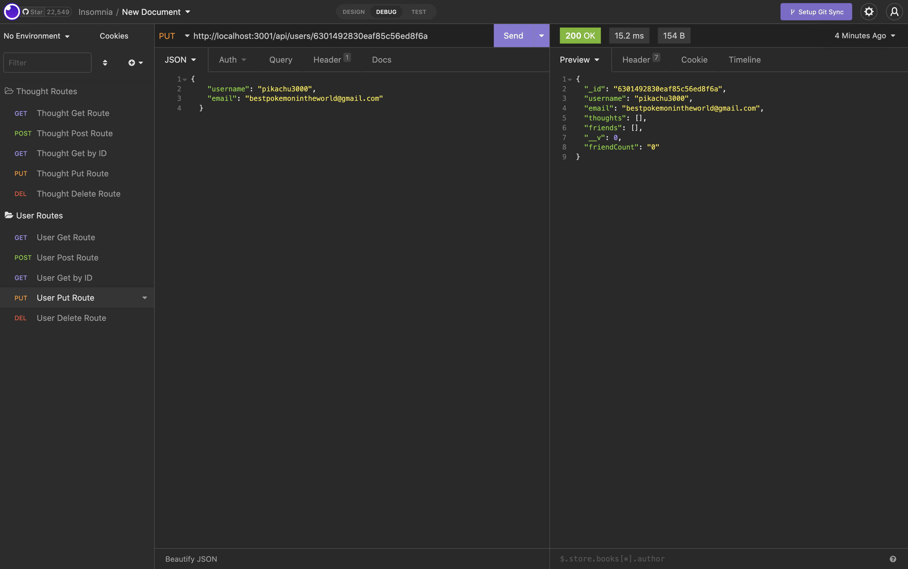
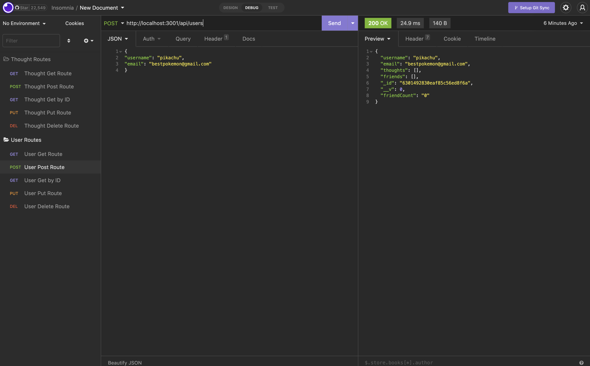
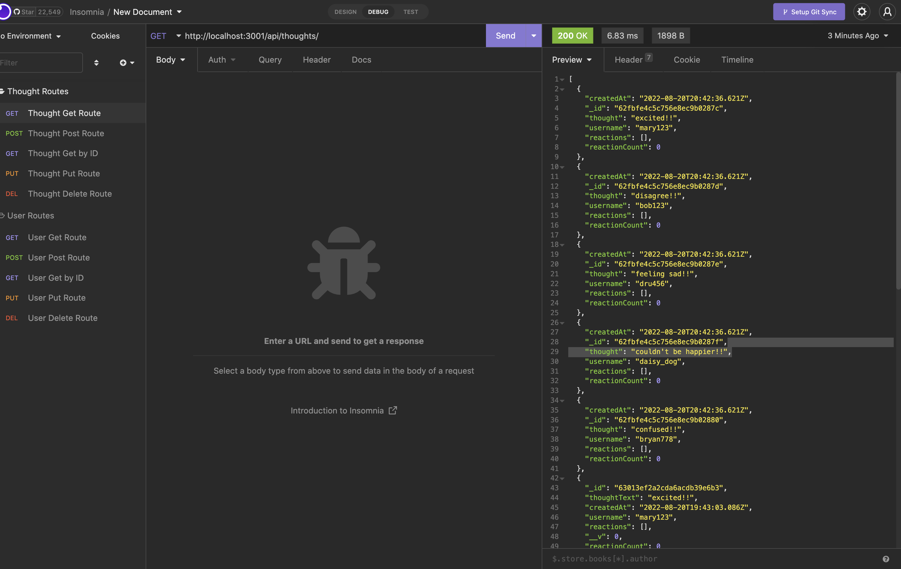

# Social Network API

## Table of Contents

- [Screenshots](#screenshots)
- [Description](#description)
- [Authors](#authors)
- [Usage](#usage)
- [Contributions](#contributions)
- [Questions](#questions)

## Screenshots

## Description

This project is a Social Network API that allows users to share their thoughts, react to friends’ thoughts, and create a friend list. This back-end application uses Express.js for routing, a MongoDB database, and the Mongoose ODM. You will need a platform to test routes, such as Insomnia.

## Authors

Code authored Mary Margaret Taylor

## Usage

[Click this link](https://www.loom.com/share/71c846a37c154eaeb8061d2f787a860f) for a tutorial on how to use this applcation.

## Contributions

This project is not accepting contributions at this time.

## Questions

If you have any questions, contact Mary Margaret Taylor at taylor.marymargaret@gmail.com. Visit the [GitHub repository link](https://github.com/mmtaylor7/Social-Network-API) if you'd like!
